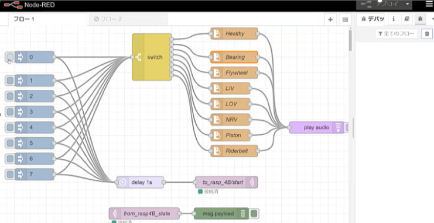

# raspi_air_compressor_wavelet_scattering_mqtt

Air compressor fault detection by Simulink, on Raspberry Pi Hardware.  
input: USB microphone on Raspberry Pi  
output: MQTT message  
  
  

## MQTT broker and Node Red setup on Windows

1. Download Mosquitto https://mosquitto.org/download/  
  $ cd C:\Program Files (x86)\mosquitto  
  $ mosquitto –  

2. Install Node-Red  https://nodered.jp/docs/getting-started/windows  
  $ node-red  
  access http://localhost:1880 on any browser  
 

## Usage

Raspi_LSTM.slx            ------Simulink model (R2023a) for deployment  
Raspi_LSTM_Sim.slx        ------Simulink model for simulation (R2023a)  
nefProjectedFinetuned.mat ------Projected & Finetuned Network called from Simulink model  
waveletScatteringLSTM_projection_HW.mlx  ------Script to create Projected & Finetuned Network  

