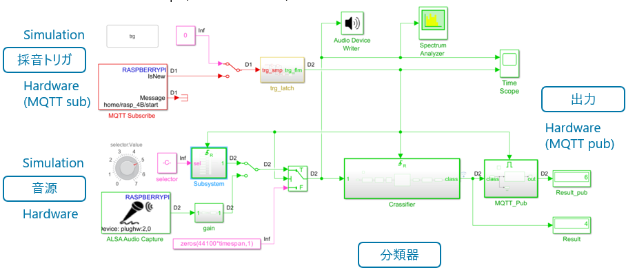

# raspi_air_compressor_wavelet_scattering_mqtt

Air compressor fault detection by Simulink&trade;, on Raspberry Pi&trade; Hardware.  
input: USB microphone on Raspberry Pi  
output: MQTT message  
  

## Setup

> 1. MQTT broker and Node Red setup on Windows (see followed step)
> 2. Deploy Node-RED&reg; flow (/utils/flows.json) on your Node-RED palette
> 3. RUN Simulink Model
 
## MathWorks Products  (https://www.mathworks.com)

Requires MATLAB&reg; release R2023b or newer
> 1. Deep Learning Toolbox&trade;
> 2. Signal Processing Toolbox&trade;
> 3. Wavelet toolbox&trade;
> 4. DSP System Toolbox&trade;  

## 3rd Party Products

> 1. MQTT broker 
> 2. Node-RED&reg;

## Installation

MQTT broker and Node-RED Installation on Windows

> 1. Download MQTT broker 
> 
> 2. Install Node-Red  https://nodered.jp/docs/getting-started/windows  
>   $ node-red  
>   access http://localhost:1880 on any browser

## Getting Started

To Run Simulation, Run model 2.  
To do Hills or deploy on Raspberry Pi, Run model 1.  
To Re-size or tune the LSTM Network, Run script 4.  

> 1. Raspi_LSTM.slx            ------Simulink model (R2023a) for deployment  
> 2. Raspi_LSTM_Sim.slx        ------Simulink model for simulation (R2023a)  
> 3. nefProjectedFinetuned.mat ------Projected & Finetuned Network called from Simulink model  
> 4. waveletScatteringLSTM_projection_HW.mlx  ------Script to create Projected & Finetuned Network  

## Examples

> 1. Related example regarding to Wavelet Scattering  
> Air Compressor Fault Detection Using Wavelet Scattering  
> https://jp.mathworks.com/help/wavelet/ug/air-compressor-fault-detection-using-wavelet-scattering.html  

>2. Related example regarding to Simulink model  
> Detect Air Compressor Sounds in Simulink Using Wavelet Scattering  
> https://jp.mathworks.com/help/dsp/ug/detect-air-compressor-sounds-in-simulink-using-wavelet-scattering.html  

## Community Support
> https://qiita.com/kureta90

Copyright 2023 The MathWorks, Inc.

